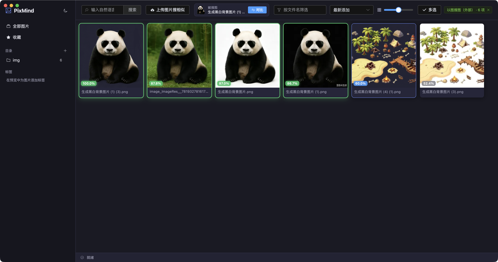

# PixMind

> A local-first desktop app for AI-powered image management and semantic search

[](./LICENSE)


PixMind is a **fully offline** desktop application that uses AI semantic understanding to manage
your local images. Type a phrase like `sunset over the sea` to find matching photos, or use
reverse image search to discover visually similar ones.

**Every image, the database, and all model inference stay on your machine — nothing is uploaded,
no network access required, no cloud services involved.**

English · [简体中文](./README.md)

---

## Screenshots

<p align="center">
  
</p>

<table>
  <tr>
    <td width="50%">
      <br>
      <sub><b>Text search</b> — describe a scene in natural language</sub>
    </td>
    <td width="50%">
      <br>
      <sub><b>Image search</b> — green badges mark near-identical matches</sub>
    </td>
  </tr>
  <tr>
    <td width="50%">
      <br>
      <sub><b>Preview & tags</b> — inspect metadata, manage tags</sub>
    </td>
    <td width="50%">
      <br>
      <sub><b>Dual themes</b> — built-in dark / light modes</sub>
    </td>
  </tr>
</table>

---

## Table of Contents

- [Screenshots](#screenshots)
- [Features](#features)
- [Tech Stack](#tech-stack)
- [Architecture](#architecture)
- [Getting Started](#getting-started)
- [Usage](#usage)
- [How It Works](#how-it-works-clip-semantic-search)
- [Models](#models)
- [Data Location](#data-location)
- [FAQ](#faq)
- [Limitations & Roadmap](#limitations--roadmap)
- [License](#license)

---

## Features

| Feature | Description |
| --- | --- |
| **Text-to-image search** | Semantic retrieval powered by CLIP — understands image content, not filenames |
| **Reverse image search** | Find similar images from the library, an uploaded file, or by **dragging a file into the window** |
| **Similarity visualization** | Results show a similarity score; `≥80%` is flagged as "near-identical" with a highlighted border |
| **Fully offline** | Local SQLite storage plus on-device ONNX inference — zero data leaves your machine |
| **Live directory watching** | `chokidar` detects added and removed files, indexing incrementally without manual refresh |
| **Resumable indexing** | Unfinished embedding jobs automatically continue on the next launch |
| **Non-blocking UI** | Image encoding runs in a dedicated `Worker` thread, keeping browsing and search responsive |
| **Virtualized grid** | Only visible rows are rendered, staying smooth with tens of thousands of images |
| **Filters + semantic search** | Narrow by directory, tag, or favorite first, then run vector search within that subset |
| **Tags & favorites** | Custom colored tags and starred favorites, filterable from the sidebar |
| **Dark / light theme** | Built-in theme switch with persisted settings |
| **Cross-platform** | macOS (dmg, x64/arm64) / Windows (NSIS) / Linux (AppImage) |

**Supported formats:** `jpg` `jpeg` `png` `gif` `webp` `bmp` `tiff` `tif` `avif` `heic`

---

## Tech Stack

| Layer | Technology |
| --- | --- |
| Desktop shell | Electron 32 (context isolation + preload script, `nodeIntegration` disabled) |
| Frontend | Vue 3 + TypeScript 5 + Vite 5 + Element Plus + Pinia |
| Local database | better-sqlite3 (WAL mode) |
| AI inference | onnxruntime-node (CLIP ViT-B/32, dual image + text encoders) |
| Image processing | sharp (thumbnails as WebP, automatic EXIF rotation) |
| File watching | chokidar |

---

## Architecture

The app separates the **Electron main process** (business logic) from the **Vue renderer**
(UI), communicating over IPC. Shared type definitions live in `shared/` and are consumed by both sides.

```
PixMind/
├── electron/                  # Main process (Node.js side)
│   ├── main.ts                # Entry: window creation, protocol registration, startup sequence
│   ├── preload.ts             # Preload script exposing a controlled API to the renderer
│   ├── core/bus.ts            # Internal event bus (progress, image added/removed)
│   ├── db/
│   │   ├── database.ts        # SQLite initialization and schema
│   │   └── repository.ts      # Repositories: dirs/images/embeddings/tags/settings
│   ├── embedding/
│   │   ├── clipConfig.ts      # Model paths and preprocessing parameters
│   │   ├── clipEngine.ts      # ONNX inference wrapper (image / text encoding)
│   │   ├── clipTokenizer.ts   # CLIP BPE tokenizer
│   │   ├── embedWorker.ts     # Image encoding worker thread
│   │   └── embeddingManager.ts# Job queue, progress reporting, resume support
│   ├── ipc/handlers.ts        # All IPC channel registrations
│   ├── scanner/               # Directory scanning, thumbnails, file watching
│   └── search/
│       ├── VectorSearchEngine.ts # Vector search abstraction
│       ├── MemoryVectorIndex.ts  # In-memory implementation (cosine similarity)
│       ├── engineFactory.ts      # Factory — the single place to swap implementations
│       └── searchService.ts      # Search business layer
├── src/                       # Renderer (Vue app)
│   ├── components/            # Sidebar / toolbar / virtual grid / preview drawer / status bar
│   ├── stores/app.ts          # Pinia global state wrapping all IPC calls
│   └── styles/                # Theme and global styles
├── shared/types.ts            # Shared types + IPC channel constants
├── models/                    # CLIP model files (downloaded, not version-controlled)
└── scripts/download-models.mjs
```

**Data flow**

```
Add directory → scan & index → generate thumbnails ┐
                                                   ├→ Worker encodes 512-dim vector → SQLite + in-memory index
File system changes (watched by chokidar)         ┘                                          ↓
                        User query (text or image) → encoded to vector → cosine similarity → ranked results
```

---

## Getting Started

### Prerequisites

- **Node.js 18+** (20 LTS recommended)
- The project depends on **native modules** (`better-sqlite3`, `sharp`, `onnxruntime-node`),
  so a build toolchain is required for the first install:
  - **macOS**: Xcode Command Line Tools (`xcode-select --install`)
  - **Windows**: Visual Studio Build Tools (C++ desktop development) + Python 3
  - **Linux**: `build-essential`, `python3`

### Install and run

```bash
# 1. Clone and install (postinstall rebuilds native modules automatically)
git clone https://github.com/geekyzs/pixmind.git
cd pixmind
npm install

# 2. Download the CLIP models (required, ~580 MB from Hugging Face)
npm run download-models

# 3. Start development mode (Vite renderer + Electron main process)
npm run dev
```

> Model files are not bundled in the repository, so **step 2 is mandatory** — otherwise AI search
> is unavailable (all other image management features still work; see [Models](#models)).

### Other commands

```bash
npm run typecheck     # TypeScript type checking
npm run build         # Type check + build + package for the current platform
npm run build:mac     # macOS dmg (x64 + arm64)
npm run build:win     # Windows NSIS installer
npm run build:linux   # Linux AppImage
```

Artifacts are written to `release/`.

### Continuous builds (GitHub Actions)

Two workflows are included:

| Workflow | Trigger | Purpose |
| --- | --- | --- |
| `.github/workflows/ci.yml` | push / PR to `main`, `develop` | Type check + compile verification (fast, no packaging) |
| `.github/workflows/build.yml` | pushing a `v*` tag, or manual dispatch | Builds installers for four targets in parallel and drafts a Release |

To publish a release:

```bash
npm version patch        # bump the version in package.json and create a tag
git push --follow-tags   # pushing the tag triggers the build and Release
```

You can also run **Build & Release** manually from the Actions tab, choosing whether to bundle the
models and whether to create a Release. Artifacts are retained for 14 days for test builds.

Note on the build matrix: the two macOS architectures are built separately on `macos-14` (arm64)
and `macos-13` (x64), because native modules such as `better-sqlite3` and `sharp` must be compiled
for the host architecture — producing both architectures on a single runner yields broken installers.

> **Code signing** is disabled by default (`CSC_IDENTITY_AUTO_DISCOVERY: false`). If you have
> certificates, store them in repository secrets (macOS: `CSC_LINK` / `CSC_KEY_PASSWORD`;
> Windows: `WIN_CSC_LINK` / `WIN_CSC_KEY_PASSWORD`) and remove that environment variable.

---

## Usage

### 1. Add an image directory

Click **+** next to "目录" (Directories) in the sidebar and pick any local folder.
Scanning, thumbnail generation, and encoding start immediately in the background, with live
progress shown in the status bar.

The `⋯` menu on each directory offers rescan, enable/disable watching, and removal
(removing only clears the index — **your files are never deleted**).

### 2. Text-to-image search

Type a description of the scene into the search box and press Enter:

```
a dog running on the grass      # English works best
sunset over the sea
person riding a bicycle
```

> The bundled CLIP ViT-B/32 is an **English-only model**. For Chinese queries, swap in an ONNX
> export of Chinese-CLIP — see [Using a Chinese model](#using-a-chinese-model).

### 3. Reverse image search (three ways)

| Method | How |
| --- | --- |
| From the library | Click an image to open the preview drawer → click **以图搜图** (Search similar) |
| Upload a file | Toolbar → **上传图片搜相似** (Upload image) → pick any local image |
| Drag and drop | Drag an image file **into the app window** and release |

Results are sorted by descending similarity, with the score shown in the lower-left corner:
`≥80%` is green and labelled "near-identical", `≥60%` is blue, and the rest are grey.

### 4. Filtering, sorting, and management

- **Filtering** — combine directory, tag, and favorite filters in the sidebar; filter by filename
  keyword from the toolbar. Filters also apply to AI search (candidates are narrowed first, then
  vector search runs within that subset).
- **Sorting** — newest/oldest added, modification time, filename, or file size.
- **Favorites** — **right-click** a thumbnail in the grid to toggle favorite; the preview drawer
  also has a favorite button.
- **Tags** — create and assign tags from the bottom of the preview drawer; counts appear in the sidebar.
- **Grid zoom** — drag the toolbar slider to resize thumbnails (120–320 px).
- **Delete** — the delete action in the preview drawer **moves the original file to the system
  trash** and clears its index entry and vector.

---

## How It Works: CLIP Semantic Search

CLIP (Contrastive Language–Image Pre-Training) maps **images** and **text** into a shared
512-dimensional vector space where semantically similar content lands close together. That makes it
possible to retrieve images directly with a text vector.

1. **Indexing** — each image is resized to 224×224 by `sharp` and normalized with CLIP's standard
   parameters, then the vision encoder produces a 512-dim vector stored as a `BLOB` in the
   `embeddings` table and mirrored in the in-memory index.
2. **Query encoding** — text is BPE-tokenized and padded to 77 tokens before passing through the
   text encoder; reverse image search goes straight through the vision encoder.
3. **Similarity** — all vectors are **L2-normalized** before storage, so a dot product at query
   time equals **cosine similarity**. A top-K min-heap keeps retrieval in the millisecond range for
   libraries of ~10k images.

### Swappable search engine

Vector retrieval sits behind the `VectorSearchEngine` interface, and the business layer depends
only on that interface:

```ts
// electron/search/engineFactory.ts — the single place to swap implementations
export function createSearchEngine(type: EngineType = 'memory'): VectorSearchEngine {
  switch (type) {
    case 'memory': return new MemoryVectorIndex()
    // case 'sqlite-vec': return new SqliteVecIndex()
    // case 'qdrant':     return new QdrantIndex({ url: '...' })
  }
}
```

Once a library outgrows the in-memory index, adding a new engine implementation is enough —
**no business code has to change**.

### Safe local image loading

Renderers block `file://` resources by default. The app registers a custom privileged protocol,
`pixmind://`, and loads originals and thumbnails as `pixmind://<encodeURIComponent(absolutePath)>`,
giving safe local file access while keeping `contextIsolation` enabled.

---

## Models

The model files are large and **not version-controlled** (see `.gitignore`); place them in `models/`:

| File | Purpose | Size |
| --- | --- | --- |
| `clip-image-vit-32.onnx` | Image encoder | ~335 MB |
| `clip-text-vit-32.onnx` | Text encoder | ~242 MB |
| `vocab.json` | BPE vocabulary | ~0.8 MB |
| `merges.txt` | BPE merge rules | ~0.5 MB |

Roughly 580 MB in total.

### Automatic download

```bash
npm run download-models
```

The script pulls the ONNX models and vocabulary from the Hugging Face repository
[`Xenova/clip-vit-base-patch32`](https://huggingface.co/Xenova/clip-vit-base-patch32), skipping
files that already exist.

### Manual setup

If your network blocks the download, fetch these files manually and rename them as shown:

| Target filename | Source path |
| --- | --- |
| `clip-image-vit-32.onnx` | `onnx/vision_model.onnx` |
| `clip-text-vit-32.onnx` | `onnx/text_model.onnx` |
| `vocab.json` | `vocab.json` |
| `merges.txt` | `merges.txt` |

### Graceful degradation

**The app does not crash when models are missing.** Scanning, browsing, thumbnails, favorites,
tags, sorting, and filtering all keep working — only text and reverse image search are disabled.
Add the models and restart, and previously indexed images are encoded automatically.

### Using a Chinese model

`clipConfig.ts` centralizes model filenames and preprocessing parameters. To support Chinese
queries, export Chinese-CLIP (e.g. ViT-B/16) to ONNX, replace both encoders and the vocabulary
files, then adjust `embeddingDim`, `contextLength`, and the tokenizer logic to match.

---

## Data Location

The database and thumbnail cache live in the OS user-data directory, leaving your image folders untouched:

| Platform | Path |
| --- | --- |
| macOS | `~/Library/Application Support/PixMind/` |
| Windows | `%APPDATA%\PixMind\` |
| Linux | `~/.config/PixMind/` |

```
PixMind/
├── data/pixmind.db     # SQLite database (image index, vectors, tags, settings)
└── thumbnails/         # WebP thumbnail cache
```

Deleting that directory fully resets the app without touching your original images.

---

## FAQ

<details>
<summary><b><code>npm install</code> fails with node-gyp errors</b></summary>

Native modules need a local toolchain. Install the platform build dependencies listed under
[Prerequisites](#prerequisites), then run `npm run postinstall` to rebuild them.
</details>

<details>
<summary><b>Search returns nothing, or warns that the CLIP model is not ready</b></summary>

1. Verify all four files exist in `models/` with reasonable sizes.
2. Check that embedding has finished in the status bar — unencoded images show a clock icon in the grid.
3. If you added the models after first launch, restart the app so they get loaded.
</details>

<details>
<summary><b>Chinese queries return poor results</b></summary>

The bundled CLIP ViT-B/32 is pre-trained on English. Query in English, or switch to Chinese-CLIP as
described in [Using a Chinese model](#using-a-chinese-model).
</details>

<details>
<summary><b>HEIC images produce no thumbnail</b></summary>

HEIC decoding depends on libheif support in the `sharp` binary, which some prebuilt packages omit.
Use a `sharp` build with HEIC support, or convert the images to JPEG/PNG first.
</details>

<details>
<summary><b>How long does indexing a large library take?</b></summary>

On CPU, CLIP ViT-B/32 takes tens to hundreds of milliseconds per image. Encoding runs sequentially
in a worker thread, so the UI stays usable and you can browse while it works. Interrupted jobs
resume on the next launch.
</details>

---

## Limitations & Roadmap

- [ ] The in-memory index uses brute-force search — fine for ~10k images, larger libraries need
      `sqlite-vec` or `Qdrant` (the interface is already in place)
- [ ] No multi-select or bulk tagging yet
- [ ] No albums/groups or duplicate detection yet
- [ ] GPU acceleration (CoreML / DirectML) not wired up
- [ ] No settings panel yet (`autoEmbed` and `concurrency` currently live only in the database)

Feel free to open an issue to discuss priorities.

---

## Contributing

Issues and pull requests are welcome.

The project follows a simplified GitHub Flow: `main` is the stable release branch and `develop` is
the integration branch. Branch off `develop` as `feature/*`, then open a PR back into `develop`.

Before submitting:

```bash
npm run typecheck   # type checking must pass
```

Please follow the existing layering: UI talks only to the Pinia store, business logic belongs in the
corresponding main-process module, and cross-boundary types go into `shared/types.ts`.

See [CONTRIBUTING.md](./CONTRIBUTING.md) for details.

---

## License

Released under the [MIT License](./LICENSE).

CLIP model weights remain the property of their original authors; please comply with the terms of
[OpenAI CLIP](https://github.com/openai/CLIP) and the corresponding Hugging Face repository.

---

## Acknowledgements

- [OpenAI CLIP](https://github.com/openai/CLIP) — the cross-modal image/text model
- [Xenova/transformers.js](https://huggingface.co/Xenova) — community ONNX model exports
- [Electron](https://www.electronjs.org/) · [Vue](https://vuejs.org/) · [Element Plus](https://element-plus.org/) · [sharp](https://sharp.pixelplumbing.com/) · [ONNX Runtime](https://onnxruntime.ai/)
